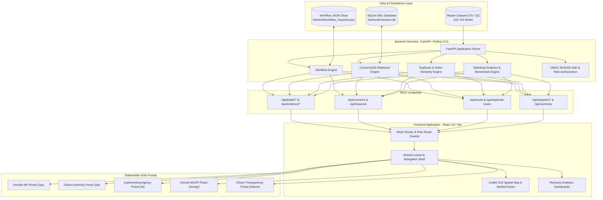
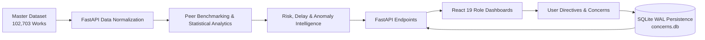
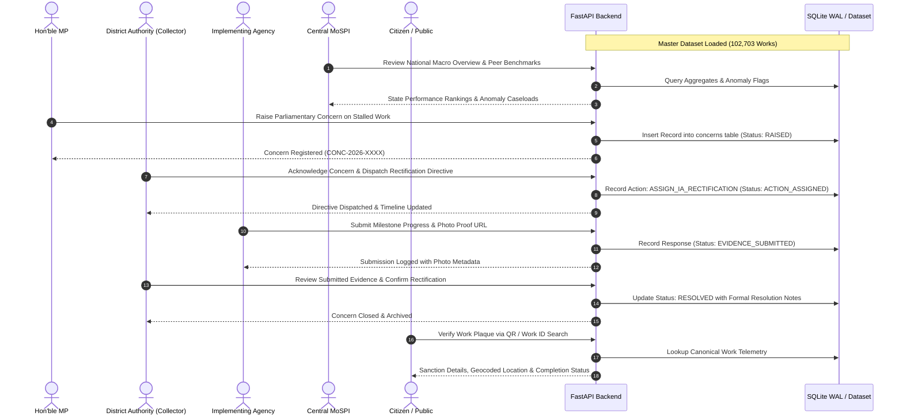

# MPLADS-AI

> AI-assisted national monitoring, risk intelligence, anomaly detection, financial analysis, and evidence-driven workflow management for the Members of Parliament Local Area Development Scheme (MPLADS).

[](https://react.dev/)
[](https://vitejs.dev/)
[](https://fastapi.tiangolo.com/)
[](https://www.python.org/)
[](https://www.sqlite.org/)
[](#license)

---

## Table of Contents

- [Problem Statement](#problem-statement)
- [Our Solution](#our-solution)
- [Key Features](#key-features)
- [Why Our Solution](#why-our-solution)
- [System Architecture](#system-architecture)
- [Detailed Data Flow](#detailed-data-flow)
- [End-to-End Workflow](#end-to-end-workflow)
- [Dashboards & Roles](#dashboards--roles)
- [MoSPI / Central Nodal Authority Module](#mospi--central-nodal-authority-module)
- [AI, Analytics & Model Usage](#ai-analytics--model-usage)
- [Model & Algorithm Table](#model--algorithm-table)
- [Technology Stack](#technology-stack)
- [Programming Languages](#programming-languages)
- [Project Structure](#project-structure)
- [Dataset](#dataset)
- [API Overview](#api-overview)
- [Test Cases](#test-cases)
- [How to Run Locally](#how-to-run-locally)
- [Environment Variables](#environment-variables)
- [Production & Deployment](#production--deployment)
- [Health Check & Operations](#health-check--operations)
- [Security Architecture](#security-architecture)
- [Limitations](#limitations)
- [Future Scope](#future-scope)
- [Demo Flow for Evaluators](#demo-flow-for-evaluators)
- [Project Highlights for Judges](#project-highlights-for-judges)
- [License](#license)
- [Contributing](#contributing)
- [Contact & Team](#contact--team)

---

## Problem Statement

The Members of Parliament Local Area Development Scheme (MPLADS) enables Hon'ble Members of Parliament to recommend developmental works in their constituencies, focusing on durable community assets such as drinking water, education, public health, sanitation, and roads. In practice, administrative oversight faces several operational challenges:

1. **Fragmented Multi-Stakeholder Oversight**: Coordination across Central Ministries (MoSPI), Members of Parliament, District Collectorates (Nodal District Authorities), Implementing Agencies (PWD, Rural Engineering, Panchayati Raj), and Citizens operates across disconnected silos.
2. **High Volume of Decentralized Works**: Tracking over 100,000 distributed infrastructure projects manually causes delays in identifying stalled or high-variance projects.
3. **Financial & Expenditure Monitoring Gaps**: Monitoring the flow from statutory ₹5.00 Crore annual entitlement to recommendation, administrative sanction, fund release, and actual expenditure requires real-time anomaly detection.
4. **Execution Delays**: Sanction and execution delays frequently exceed statutory guidelines without triggering early administrative alerts.
5. **Duplicate & Overlapping Proposals**: Identifying similar or identical works proposed across neighboring financial years, schemes, or adjacent locations requires text and geospatial similarity screening.
6. **Physical Evidence & Milestone Verification**: Ensuring contractor billing aligns with verified physical progress, geo-coordinates, and on-site evidence before completion certificates are issued.
7. **Public Transparency**: Citizens lack straightforward, localized tools to inspect community assets, verify plaques, and report ground-level defects.

---

## Our Solution

**MPLADS-AI** is an integrated monitoring, intelligence, and accountability platform that bridges macro-surveillance with ground-level execution across all 5 key administrative stakeholders.

```
Master Dataset (102,703 Works)
  └── Analytics & Peer Benchmarking
        └── Anomaly & Duplicate Detection
              └── Spatial Telemetry & Geo-Evidence
                    └── Relational Action Workflow (SQLite WAL)
                          └── Closed-Loop Administrative Accountability
```

### Core Solution Pillars:
- **Central Nodal Surveillance**: Pan-India macro-monitoring across all 36 States and Union Territories with state, district, and agency intelligence.
- **Data-Driven Risk & Anomaly Detection**: Automated flagging of delay deviations, cost-to-peer anomalies, and lifecycle variances against empirical peer medians.
- **Duplicate Detection & Cluster Surveillance**: Lexical token matching and clustering to detect repeated or split work proposals.
- **Relational Work Concerns Engine**: ACID-compliant, persistent two-way workflow linking MPs, District Authorities, and Implementing Agencies with an immutable audit ledger.
- **Social Audit & Citizen Verification**: Public exploration portal with QR plaque verification and grievance redressal tracking.

---

## Key Features

### National Monitoring
- **Pan-India Macro Surveillance**: Real-time aggregation of national entitlement, recommendations, sanctions, and actual expenditure across 102,703 works.
- **Inter-State Performance Comparisons**: Expenditure ratios, sanction velocity, and unspent balance tracking across all 36 States and Union Territories.
- **District Intelligence**: Drilldown into District Authority (Collectorate) administrative performance, pending sanctions, and active caseloads.
- **Implementing Agency Ranking**: Execution velocity and delay metrics across PWD, Zila Parishad, and regional engineering divisions.

### Financial Intelligence
- **Entitlement vs. Release vs. Expenditure**: Full lifecycle accounting tracking statutory allocations against actual ground utilization.
- **Cost Variance Detection**: Identifies projects exhibiting significant cost escalation between administrative sanction and final expenditure.
- **Peer Cost Benchmarking**: Contextual cost evaluation against median allocations for similar asset categories within the same administrative zone.

### Risk & Anomaly Intelligence
- **Multi-Factor Risk Scoring**: Evaluates works across Sanction Delay Risk, Completion Duration Risk, Cost Outlier Risk, and Variance Risk.
- **Early Warning Center**: Proactive alert feeds highlighting works requiring urgent administrative intervention.
- **Statutory Milestone Tracking**: Alerts on works violating operational guideline timelines (e.g., sanctioning within 75 days).

### Duplicate Intelligence
- **Cluster-Based Similarity Detection**: Surfaces clusters of works sharing elevated description overlap, financial amounts, and geographic proximity.
- **Pre-Sanction Proposal Validator**: Pre-execution screening tool allowing District Authorities to check new proposals against existing works before issuing financial sanctions.

### Evidence Intelligence
- **Milestone Photo Verification**: Photo evidence analysis verifying camera hardware sensors, timestamps, and site boundaries.
- **Geofence Boundary Validation**: Compares photo capture GPS telemetry against approved project site coordinates.
- **Perceptual Hash (pHash) Matching**: Flags potential cross-project duplicate photo reuse across contractor billing claims.

### Stakeholder Workflows
- **Hon'ble MP Portal**: Quota management, constituency work tracking, and direct concern escalation to District Authorities.
- **District Authority Portal**: Administrative scrutiny, statutory directive issuance to Implementing Agencies, and milestone clearance.
- **Implementing Agency Portal**: Work milestone reporting, Measurement Book (MB) submissions, and photo evidence uploads.
- **Central MoSPI Portal**: National audit surveillance, cross-state benchmarking, and ministerial escalation tracking.

### Citizen Transparency
- **Public Work Explorer**: Open exploration of sanctioned and completed community assets filterable by State, Constituency, and Sector.
- **GIS Spatial Distribution Map**: Interactive Leaflet map with marker clustering displaying geocoded local infrastructure.
- **QR Plaque Verifier**: Instant validation of on-site project plaques against official digital records.
- **Public Grievance Redressal**: Submission and tracking of localized grievance reports through a transparent 6-stage lifecycle.

---

## Why Our Solution

| Capability | Traditional Manual Approach | MPLADS-AI Platform |
|:---|:---|:---|
| **Monitoring Scope** | Periodic sample audits and static spreadsheets | Comprehensive real-time analysis over 102,703 works |
| **Risk Detection** | Post-completion audit after funds are disbursed | Pre-sanction and in-flight anomaly and delay alerts |
| **Duplicate Prevention** | Dependent on institutional memory | Automated token similarity and cluster surveillance |
| **Accountability Loop** | Ad-hoc correspondence across separate offices | Centralized, persistent directive-action-response audit trail |
| **Public Participation** | Limited access to physical records | Open GIS exploration, plaque QR verification, and tracked grievances |
| **Data Integrity** | Disconnected registers | Single source of truth with ACID-compliant SQLite WAL persistence |

---

## System Architecture



---

## Detailed Data Flow

1. **Ingestion & Normalization**: The backend initializes by loading `backend/data/mplads_final_dataset.csv` (or `.csv.gz`), parsing date formats, cleaning non-finite values, and generating indexed text search columns.
2. **Statistical Aggregations**: The analytics engine computes baseline totals, state aggregations, sector distributions, and peer medians (sanction delay, duration, cost).
3. **Risk & Anomaly Classification**: Multi-factor risk heuristics calculate composite scores, categorizing works into High, Medium, or Low risk tiers.
4. **API Exposure**: FastAPI exposes structured, paginated, and role-scoped endpoints consumed by the frontend.
5. **Client-Side Hydration**: React 19 dashboards consume REST APIs with role-based routing, local caching, and error resilience.
6. **Relational Workflow Execution**: User directives, responses, and evidence attachments are committed to `backend/concerns.db` with SQLite Write-Ahead Logging (WAL) and foreign-key integrity.



---

## End-to-End Workflow



---

## Dashboards & Roles

The application enforces role isolation across 5 stakeholder personas via `app/src/data/roles.js` and server-side authorization:

| Role | Route | Primary Responsibility | Key Capabilities |
|:---|:---|:---|:---|
| **Member of Parliament** | `/mp` | Constituency oversight & recommendations | Recommend works, monitor ₹5.00 Cr quota utilization, review constituency delivery, raise parliamentary concerns. |
| **District Authority** | `/da` | District nodal administration & sanction | Administrative scrutiny, pre-sanction checks, issuing statutory directives to IAs, fund release, resolving concerns. |
| **Implementing Agency** | `/ia` | Field execution & milestone reporting | Milestone updates, Measurement Book (MB) recordings, time extension requests, photo evidence uploads. |
| **Central MoSPI** | `/mospi` | Pan-India macro surveillance & audit | 13 national surveillance tabs, cross-state benchmarking, duplicate clustering, national concern escalations. |
| **Citizen Portal** | `/citizen` | Public transparency & social audit | Explore 102,703 works, interactive GIS map, QR code plaque verification, public grievance redressal tracking. |

---

## MoSPI / Central Nodal Authority Module

The MoSPI dashboard (`app/src/pages/dashboards/MoSPI/MoSPIDashboard.jsx`) provides 13 dedicated surveillance modules:

1. **National Overview**: Key national performance indicators, entitlement pipeline, fund flow summary, and critical caseload counters.
2. **State Intelligence**: Cross-state comparisons of sanction ratios, expenditure velocity, and unspent balances.
3. **District Intelligence**: Collectorate-level tracking of active projects, sanction delays, and local implementation performance.
4. **Risk Intelligence**: Multi-dimensional risk scoring categorizing works into High, Medium, and Low risk tiers.
5. **Anomaly Detection**: Statistical outliers in cost variance, extreme completion delays, and unusual budget allocations.
6. **Duplicate Intelligence**: Cluster surveillance identifying potential duplicate or overlapping works.
7. **Financial Intelligence**: Macro expenditure trends, fund utilization ratios, and financial flow analysis across years.
8. **Delay Intelligence**: Granular tracking of sanction delays (recommendation to sanction) and completion durations.
9. **IA Performance**: Operational metrics and delivery timelines across executing bodies and engineering departments.
10. **Evidence Intelligence**: Audit tracking of physical inspections, photo proofs, and milestone verifications.
11. **Trend Analysis**: Temporal time-series patterns of work recommendations, sanctions, and completion rates.
12. **Priority Cases**: Curated triage queue of high-risk, high-cost, and delayed works requiring immediate administrative intervention.
13. **National Work Concerns**: Pan-India registry of formal concerns, directives, and resolutions with inter-state filtering.

---

## AI, Analytics & Model Usage

To ensure technical transparency, the analytical components of MPLADS-AI are categorized by their underlying method:

### 1. Data Analytics & Statistical Benchmarking
- **Peer Median Comparisons**: Baseline medians calculated dynamically across work categories (e.g., peer median completion time, peer median sanction amount). Works are evaluated using relative ratios ($Cost / PeerMedian$).
- **Lifecycle Duration Analysis**: Calculates exact day deltas between recommendation, sanction, and completion dates.
- **Financial Flow Ratios**: Computes utilization rates and cost variance percentages:
  $$\text{Cost Variance \%} = \frac{\text{Actual Expenditure} - \text{Sanction Amount}}{\text{Sanction Amount}} \times 100$$

### 2. Rule-Based Risk Intelligence
- **Multi-Factor Scoring**: Composite risk scores derived from weighted risk rules across four operational dimensions:
  - *Sanction Delay Risk*: Violation of statutory guideline sanction limits.
  - *Completion Risk*: Physical execution duration exceeding sector benchmarks.
  - *Cost Anomaly Risk*: Sanctions significantly exceeding category peer medians.
  - *Variance Risk*: Severe cost overruns between sanction and final billing.

### 3. Similarity & Duplicate Detection
- **Token-Based Lexical Similarity**: Evaluates proposal text against existing works using word token extraction and Jaccard similarity:
  $$J(A, B) = \frac{|A \cap B|}{|A \cup B|} \times 100$$
- **Cluster Surveillance**: Precomputed pairwise similarities and cluster suspicion scores based on description concentration, amount matching, and date proximity.

### 4. Geospatial & Telemetry Verification
- **Geofence Distance Evaluation**: Haversine/Euclidean distance verification comparing photo EXIF GPS coordinates against sanctioned site boundaries (50-meter threshold).
- **Perceptual Hashing (pHash)**: Evaluates image similarity fingerprints to identify duplicate photo submissions across multiple billing milestones.

> **Note on Machine Learning**: The current system utilizes statistical analytics, lexical similarity metrics, heuristic risk scoring, and spatial validation algorithms rather than a black-box deep learning model. This ensures complete auditability and explainability for government administrators.

---

## Model & Algorithm Table

| Capability | Method / Algorithm | Input Parameters | Output | Administrative Purpose |
|:---|:---|:---|:---|:---|
| **Pre-Sanction Duplicate Check** | Jaccard Token Overlap & Substring Match | Proposal description, State, Constituency | Similarity percentage ($0-100\%$) and matched works | Prevents sanctioning duplicate works at proposal stage |
| **Peer Cost Anomaly Detection** | Median Benchmark Ratio | Sanction amount, Category, State | Cost-to-peer ratio ($x$ times peer median) | Identifies unusually inflated project estimates |
| **Lifecycle Delay Risk** | Guideline Threshold Evaluation | Recommendation Date, Sanction Date, End Date | Delay in days, Delay Risk Tier (High / Med / Low) | Flags administrative delays violating statutory limits |
| **Cost Variance Analysis** | Percentage Deviation Calculation | Sanction Amount, Actual Amount | Cost Variance Percentage & Outlier Flag | Surfaces projects with significant budget overruns |
| **Duplicate Cluster Surveillance** | Clustered Pairwise Similarity Scoring | Work descriptions, amounts, recommendation dates | Cluster Suspicion Score ($0-100$), Cluster ID | Identifies repeated work clusters across fiscal years |
| **Photo Geofence Validation** | Spatial Proximity Calculation | Inspection GPS coordinates, Sanctioned coordinates | Boundary distance (meters) & Pass/Fail flag | Detects off-site or spoofed photo submissions |
| **Photo Reuse Detection** | Image Perceptual Hashing (pHash) | Milestone inspection photos | Hash distance & match percentage | Flags cross-project photo reuse for billing claims |

---

## Technology Stack

| Layer | Technology | Version | Purpose |
|:---|:---|:---|:---|
| **Frontend Framework** | React | `19.2.8` | Component-based user interface |
| **Build Tool** | Vite | `8.2.2` | Development server and production bundling |
| **Routing** | React Router DOM | `7.18.2` | Client-side routing and role protection |
| **Data Visualization** | Recharts | `3.10.1` | Financial and administrative charts |
| **GIS Mapping** | Leaflet & React Leaflet | `1.9.4` / `5.0.0` | 2D interactive constituency maps |
| **Map Clustering** | Leaflet MarkerCluster | `1.5.3` | Performance clustering for high-density geo-markers |
| **Icons** | Lucide React | `1.34.0` | UI iconography |
| **Backend Framework** | FastAPI | `>=0.110.0` | High-performance Python REST API |
| **ASGI Server** | Uvicorn | `>=0.28.0` | Asynchronous application server |
| **Data Processing** | Pandas | `>=2.0.0` | Dataset manipulation and analytics |
| **Relational Database** | SQLite 3 | Built-in (Python 3.11) | ACID-compliant concerns store with WAL mode |
| **Data Validation** | Pydantic | `>=2.0.0` | Request and response schema validation |
| **Authentication** | HMAC-SHA256 | Built-in (Python 3.11) | Cryptographic session tokens with role claims |

---

## Programming Languages

- **JavaScript (ES6+) / JSX**: Frontend logic, UI components, and state management.
- **Python (3.11)**: Backend API, analytics computations, database abstraction, and auth.
- **SQL (SQLite dialect)**: Relational schema definitions, foreign keys, and transactions.
- **CSS3**: Custom design system tokens, responsive layouts, and animations.
- **HTML5**: Base DOM structure and semantic elements.

---

## Project Structure

```
MPLADS-AI2/
├── README.md                      # Comprehensive project documentation
├── start.sh                       # Unified development startup script
├── app/                           # Frontend React application
│   ├── index.html                 # Single-page application entry point
│   ├── package.json               # Frontend dependencies and build scripts
│   ├── vite.config.js             # Vite build and proxy configuration
│   ├── vercel.json                # Vercel deployment routing configuration
│   └── src/
│       ├── App.jsx                # Application root and route definitions
│       ├── main.jsx               # React DOM hydration entry point
│       ├── constants.js           # API base URL and formatting utilities
│       ├── design-system.css      # Core CSS tokens and typography
│       ├── components/            # Reusable UI components
│       │   ├── ConstituencyMap.jsx    # Leaflet GIS spatial map
│       │   ├── EarlyWarningCenter.jsx # Real-time alert stream
│       │   ├── GeoPhotoVerifier.jsx   # Photo and EXIF verification
│       │   ├── PreSanctionValidator.jsx # Pre-sanction check tool
│       │   ├── WorkDetailDrawer.jsx   # Detailed work dossier drawer
│       │   └── workflow/              # Work concern modals and tables
│       ├── context/               # Authentication and Language context
│       ├── data/                  # Static role definitions and constants
│       ├── pages/                 # Full-page views and shared tools
│       │   ├── DuplicateIntelligence.jsx # Duplicate cluster exploration
│       │   ├── ReviewQueue.jsx           # Caseload review queue
│       │   ├── RiskIntelligence.jsx      # Risk-scored works catalog
│       │   ├── StateIntelligence.jsx     # State performance rankings
│       │   ├── WorkExplorer.jsx          # Public works search table
│       │   ├── Login/                    # Persona selection login
│       │   └── dashboards/               # Role-specific dashboard portals
│       │       ├── MPDashboard.jsx           # Hon'ble MP portal
│       │       ├── DADashboard.jsx           # District Authority portal
│       │       ├── IADashboard.jsx           # Implementing Agency portal
│       │       ├── CitizenDashboard.jsx      # Citizen transparency portal
│       │       └── MoSPI/                    # Central MoSPI 13-tab portal
│       ├── routes/                # ProtectedRoute and RoleRoute guards
│       └── services/              # API abstraction services
└── backend/                       # Backend FastAPI application
    ├── main.py                    # Primary FastAPI server and route handlers
    ├── auth.py                    # HMAC-SHA256 session and role verification
    ├── concerns_db.py             # SQLite WAL relational workflow database
    ├── workflow_engine.py         # Cross-role request routing engine
    ├── requirements.txt           # Python package dependencies
    ├── .env.example               # Environment variable template
    ├── Procfile                   # Railway / Heroku deployment process file
    ├── railway.json               # Railway deployment configuration
    └── data/                      # Canonical dataset files
        ├── mplads_final_dataset.csv   # Master dataset (102,703 works)
        ├── mplads_final_dataset.csv.gz # Compressed master dataset
        └── duplicate_clusters.csv     # Duplicate cluster metadata
```

---

## Dataset

- **Primary File**: `backend/data/mplads_final_dataset.csv` (supported compressed as `.csv.gz`).
- **Volume**: **102,703 individual work records** spanning 36 States and Union Territories.
- **Attributes**: 79 columns encompassing project identification, financial figures, milestones, delays, peer medians, and risk scores.
- **Core Schema Fields**:
  - `WORK_ID` / `WORK_RECOMMENDATION_DTL_ID`: Canonical unique identifiers.
  - `STATE_NAME`, `CONSTITUENCY`, `IDA_NAME`: Administrative hierarchy.
  - `MP_NAME`, `HOUSE_OF_PARLIAMENT`: Sponsoring Member of Parliament.
  - `WORK_CATEGORY`, `ACTIVITY_NAME`, `WORK_DESCRIPTION`: Project classification.
  - `RECOMMENDATION_DATE`, `SANCTION_DATE`, `ACTUAL_END_DATE`: Lifecycle timestamps.
  - `RECOMMENDED_AMOUNT`, `SANCTION_AMOUNT`, `ACTUAL_AMOUNT`: Financial accounting.
  - `SANCTION_DELAY_DAYS`, `COMPLETION_DURATION_DAYS`: Operational duration metrics.
  - `PEER_MEDIAN_*`: Comparative benchmark baselines across categories.
  - `RISK_SCORE`, `RISK_LEVEL`, `RISK_REASON`: Automated risk assessment.
  - `CLUSTER_ID`, `CLUSTER_SUSPICION_SCORE`, `DUPLICATE_RISK`: Duplicate intelligence.
- **Dataset Context & Limitations**: The dataset reflects historical records provided for prototype development. Some records have incomplete physical completion dates, and geocoded coordinates represent representative constituency/locality centroids.

---

## API Overview

### System & Health Probes
- `GET /healthz` — Operational health probe verifying dataset and database readiness.
- `GET /api/health` — Secondary health probe for platform deployment checks.
- `GET /api/summary` — High-level metrics: total works, risk distributions, financial sums.

### Works & Spatial Telemetry
- `GET /api/works` — Paginated work explorer supporting search, state, constituency, category, and stage filters.
- `GET /api/works/geo` — Geocoded work coordinates optimized for interactive map visualization.
- `GET /api/works/{work_id}` — Canonical work dossier including financial history, peer comparison, and logged concerns.

### Risk, Anomaly & Duplicate Intelligence
- `GET /api/risk-cases` — Paginated catalog of High and Medium risk projects.
- `GET /api/duplicate-cases` — Clustered duplicate work groups sorted by suspicion score.
- `GET /api/clusters/{cluster_id}` — Detailed breakdown of works sharing a duplicate cluster.
- `GET /api/alerts/early-warning` — Dynamic alert feed categorizing urgent administrative flags.
- `GET /api/validate-proposal` — Pre-sanction check evaluating proposal text and budget against historical works.

### Administrative Analytics
- `GET /api/analytics/mospi` — National surveillance summary: entitlement, sanction, and completion ratios.
- `GET /api/analytics/states` — State-by-state performance matrix and anomaly counts.
- `GET /api/analytics/mp` — Parliamentary constituency summary scoped by MP name.
- `GET /api/analytics/da` — District Authority administrative metrics scoped by IDA.
- `GET /api/analytics/ia` — Implementing Agency performance, active works, and completion rates.

### Relational Work Concerns (SQLite WAL)
- `POST /api/concerns` — File a formal concern against a canonical work ID.
- `GET /api/concerns` — Query concerns filtered by role, status, priority, or state.
- `GET /api/concerns/metrics` — Aggregate counters of open, assigned, and resolved concerns.
- `GET /api/concerns/{id}` — Full concern record with nested actions, responses, and timeline.
- `PATCH /api/concerns/{id}` — Update concern status with server-side transition checks.
- `POST /api/concerns/{id}/actions` — Record an administrative action or directive.
- `POST /api/concerns/{id}/responses` — Submit an IA response or progress report with evidence links.

### Citizen Transparency & Grievance Redressal
- `GET /api/public/overview` — Public summary of delivered assets and expenditure totals.
- `GET /api/public/constituency/{name}` — Constituency transparency scorecard and work stage distribution.
- `GET /api/public/verify/{work_id}` — QR verification endpoint returning work sanction authenticity.
- `GET /api/public/grievances` — Public grievance feed tracking citizen-reported defects.
- `POST /api/public/grievances` — Submit a citizen defect report with rate limiting.

---

## Test Cases

The application includes automated backend test scripts and rigorous frontend build validations:

| Test ID | Category | Scenario Tested | Expected Result | Verified Status |
|:---|:---|:---|:---|:---:|
| **TC-001** | Functional | Load `/api/summary` with master dataset | Returns 102,703 works with complete financial totals | **PASS** |
| **TC-002** | Functional | Filter works by State (`Telangana`) and Category | Returns matching filtered records with correct pagination | **PASS** |
| **TC-003** | Workflow | Create concern (`CONC-2026-0001`) via ConcernsDB | Concern created with status `RAISED`, linking work metadata | **PASS** |
| **TC-004** | Workflow | DA acknowledges concern and assigns to IA | Status transitions to `ACTION_ASSIGNED` with assigned officer | **PASS** |
| **TC-005** | Workflow | IA submits progress update with evidence URL | Status advances to `EVIDENCE_SUBMITTED`, timeline logged | **PASS** |
| **TC-006** | Workflow | DA marks concern resolved with formal grounds | Status becomes `RESOLVED`, `resolved_at` timestamp recorded | **PASS** |
| **TC-007** | Intelligence | Pre-sanction check with similar text | Returns matching works with Jaccard overlap $>50\%$ | **PASS** |
| **TC-008** | Intelligence | Peer cost benchmark check on ₹50 Lakh proposal | Computes cost ratio against category median (~₹18.5 Lakh) | **PASS** |
| **TC-009** | Security | Token spoofing attempt with altered role payload | HMAC verification fails with `401 Unauthorized` | **PASS** |
| **TC-010** | Security | Citizen grievance submission spam | In-memory rate limiter enforces cooldown window | **PASS** |
| **TC-011** | Build / Lint | Frontend ESLint verification (`npm run lint`) | Clean exit code 0 across 2,473 modules (0 errors, 0 warnings) | **PASS** |
| **TC-012** | Build | Vite production compilation (`npm run build`) | Successfully bundles client assets in under 500ms | **PASS** |

---

## How to Run Locally

### Prerequisites
- **Node.js**: `v18.x` or higher (recommended: `v20.x`)
- **npm**: `v9.x` or higher
- **Python**: `3.11.x`
- **Git**

### 1. Clone the Repository
```bash
git clone <repository-url>
cd MPLADS-AI2
```

### 2. Backend Setup
```bash
# Navigate to backend directory
cd backend

# Create and activate Python virtual environment
python3 -m venv venv
source venv/bin/activate  # On Windows: venv\Scripts\activate

# Install dependencies
pip install -r requirements.txt

# Start the FastAPI server
uvicorn main:app --host 127.0.0.1 --port 8000 --reload
```
The backend API documentation is now live at: `http://127.0.0.1:8000/docs`.

### 3. Frontend Setup
In a new terminal window:
```bash
# Navigate to frontend directory
cd app

# Install Node dependencies
npm install

# Start the Vite development server
npm run dev
```
The application dashboard is now accessible at: `http://localhost:5173`.

### 4. Alternative: One-Click Startup Script (macOS / Linux)
From the project root:
```bash
chmod +x start.sh
./start.sh
```

---

## Environment Variables

### Backend Configuration (`backend/.env`)
Copy `backend/.env.example` to `backend/.env`:

| Variable | Default Value | Description |
|:---|:---|:---|
| `ALLOWED_ORIGINS` | `http://localhost:5173` | Comma-separated CORS allowed origins (e.g., your Vercel URL in production). |
| `CONCERNS_DB_PATH` | `backend/concerns.db` | File path for the persistent SQLite database. Set to persistent volume on cloud hosting. |
| `AUTH_SECRET_KEY` | *(Internal default salt)* | Secret key used to sign HMAC-SHA256 session tokens. |
| `PORT` | `8000` | Port for the backend application server. |
| `HOST` | `0.0.0.0` | Bind host address for Uvicorn. |

### Frontend Configuration (`app/.env`)
Copy `app/.env.example` to `app/.env`:

| Variable | Default Value | Description |
|:---|:---|:---|
| `VITE_API_BASE_URL` | *(empty string)* | Base URL for the backend API. Leave blank in local dev to use Vite proxy. |
| `VITE_MAPTILER_API_KEY` | *(optional)* | MapTiler vector tile API key. Falls back to OpenStreetMap tiles if omitted. |

---

## Production & Deployment

The application is architected for decoupled cloud deployment:

```
[ Frontend: Vercel ]  ──HTTPS──>  [ Backend API: Railway / Linux VPS ]  <──>  [ SQLite WAL Volume ]
```

### Frontend (Vercel)
- **Framework Preset**: Vite
- **Root Directory**: `app`
- **Build Command**: `npm run build`
- **Output Directory**: `dist`
- **SPA Rewrites**: Handled by `app/vercel.json`:
  ```json
  {
    "rewrites": [{ "source": "/(.*)", "destination": "/index.html" }]
  }
  ```
- **Environment Variable**: Set `VITE_API_BASE_URL=https://your-backend.up.railway.app`.

### Backend (Railway / Containerized)
- **Deployment Spec**: Defined in `backend/railway.json` using Nixpacks.
- **Start Command**: `uvicorn main:app --host 0.0.0.0 --port $PORT`
- **Health Check Path**: `/api/health`
- **Persistent Volume**: Mount a volume (e.g., `/data`) and set `CONCERNS_DB_PATH=/data/concerns.db` to ensure concern workflows persist across container redeployments.
- **CORS**: Set `ALLOWED_ORIGINS=https://your-app.vercel.app`.

---

## Health Check & Operations

- **Liveness & Readiness**: `GET /healthz` returns `{"status":"ok"}` after confirming:
  1. The master dataset DataFrame is in memory with active records.
  2. The SQLite database connection is open and readable.
- **Platform Monitoring**: `GET /api/health` provides deployment health probe compatibility with Railway, Render, and container orchestrators.

---

## Security Architecture

- **Authoritative Server-Side Validation**: All mutating workflow actions (`/api/concerns`, `/api/requests`) enforce cryptographic role verification. Client-side role claims cannot bypass backend checks.
- **HMAC-SHA256 Session Tokens**: Stateless session tokens generated with SHA256 cryptographic signatures and expiration validation (`backend/auth.py`).
- **Strict CORS Origin Whitelisting**: Dynamic configuration prevents cross-site request forgery while accommodating multi-environment preview URLs.
- **API Rate Limiting**: In-memory rate limiting on public grievance submissions protects against submission floods.
- **Input Sanitization**: Pydantic schemas enforce bounds on pagination, search parameters, and request payloads.
- **Prototype Authentication Note**: The current build features a persona-selection login screen designed for competition demonstration. Production deployment would integrate with government SSO (e.g., MeriPehchan / Jan Parichay).

---

## Limitations

In the interest of full technical candor for evaluation:
1. **Historical Dataset**: The prototype operates on a static master dataset of 102,703 works. Live synchronization with the national e-Sakshi portal is not yet connected.
2. **Geocoding Precision**: Approximately 30% of works lack fine-grained GPS coordinates and are geocoded to district or constituency administrative centroids.
3. **Prototype Auth Portal**: The login screen facilitates rapid role switching for evaluation; production rollout requires integration with enterprise government identity providers.
4. **Single-Node SQLite Persistence**: The current concerns database uses SQLite with WAL mode, ideal for single-instance container deployment. Scaling horizontally requires PostgreSQL migration.

---

## Future Scope

- **Live e-Sakshi API Integration**: Direct bidirectional sync with MoSPI's central e-Sakshi portal for real-time recommendation and sanction ingestion.
- **Computer Vision Model for Defect Detection**: Deploying edge computer vision models to automatically assess structural cracks, paving degradation, and incomplete construction from uploaded photos.
- **Jan Parichay SSO Integration**: National single sign-on integration providing Aadhaar-backed authentication for MPs, Collectors, and Engineers.
- **Automated SMS & WhatsApp Alerts**: Integration with government messaging gateways to dispatch instant SMS alerts to MPs and District Authorities upon milestone delays.
- **Citizen Offline Mobile App**: Lightweight mobile PWA enabling rural citizens to take geo-tagged social audit photos in low-connectivity areas.

---

## Demo Flow for Evaluators

For judges and evaluators reviewing the live demonstration:

1. **National Surveillance**:
   - Navigate to `/mospi`. Inspect the **National Overview** showing national totals, entitlement flow, and caseload distribution.
   - Switch to **State Intelligence** to view inter-state expenditure ratios and anomaly rankings.
2. **Anomaly & Risk Discovery**:
   - Open **Risk Intelligence** or **Duplicate Intelligence** to inspect flagged works.
   - Click on any work to open the **Work Detail Drawer** displaying financial history and peer benchmarks.
3. **Pre-Sanction Validation**:
   - Navigate to **Pre-Sanction Validator** (`/pre-sanction`). Enter a sample proposal (e.g., *"Installation of Solar High Mast Light at Main Junction"*, budget ₹5,00,000).
   - Observe the Jaccard similarity score and peer cost ratio comparison against historical works.
4. **Administrative Directive & Concern Flow**:
   - Log in as **Hon'ble MP** (`/mp`). Open **Parliamentary Concerns** and view logged items or create a new concern.
   - Switch to **District Authority** (`/da`). Open the concern, review the MP's request, and issue a directive to the **Implementing Agency**.
   - Switch to **Implementing Agency** (`/ia`). Submit physical progress with an evidence attachment.
   - Return to **District Authority** to review the submitted evidence and mark the concern `RESOLVED`.
5. **Citizen Social Audit**:
   - Navigate to `/citizen`. Explore local works on the **GIS Spatial Map**.
   - Use the **Verify Plaque** tab to enter a sample Work ID (`70853`) to inspect real-time digital sanction authenticity.

---

## Project Highlights for Judges

- **Real-Scale Data Processing**: Operates smoothly over **102,703 real-world developmental works** spanning all 36 States and UTs.
- **Zero Mock Fallbacks**: Dashboards, metrics, and risk scores are calculated directly from empirical dataset values.
- **Full-Spectrum Role Architecture**: Provides distinct, tailored operational portals for all 5 stakeholders in the administrative chain.
- **Explainable Anomaly Detection**: Replaces black-box assertions with auditable peer median comparisons and transparent token similarity metrics.
- **Closed-Loop Administrative Accountability**: Built-in directive-action-response workflow backed by an ACID-compliant SQLite WAL database.
- **High-Performance Production Build**: Strict React 19 / ESLint compliance with zero warnings and sub-second Vite bundling.

---

## License

License information is not currently specified. All rights reserved.

---

## Contributing

Contributions, bug reports, and pull requests are welcome. Please ensure that:
1. Changes pass all frontend lint checks (`npm run lint` in `app/`).
2. Backend endpoints pass automated workflow test suites (`python backend/test_concerns_workflow.py`).
3. No personal machine paths, API keys, or credentials are committed.

---

## Contact & Team

Developed as a Smart India Hackathon (SIH) prototype for AI-assisted MPLADS monitoring, risk intelligence, and administrative accountability.
